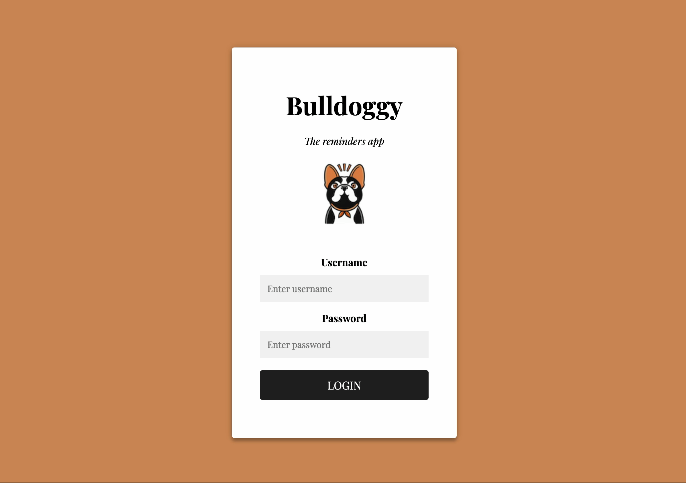
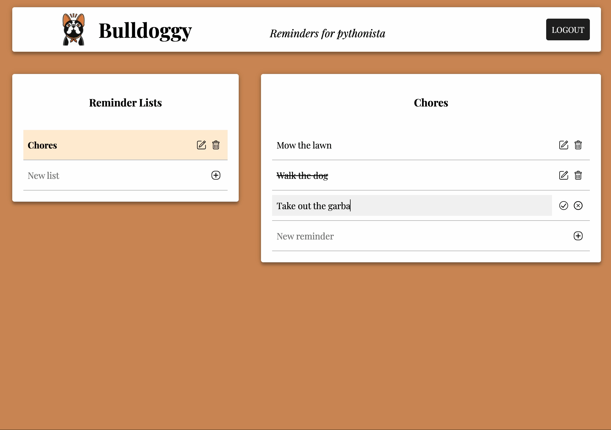

# Bulldoggy: The Reminders App

*Bulldoggy* is a small demo web app for tracking reminders.
It uses:

* [Python](https://www.python.org/) as the main programming language
* [FastAPI](https://fastapi.tiangolo.com/) for the backend
* [HTMX](https://htmx.org/) 1.8.6 for handling dynamic interactions (instead of raw JavaScript)
* [Jinja templates](https://jinja.palletsprojects.com/en/3.1.x/) with HTML and CSS for the frontend
* [TinyDB](https://tinydb.readthedocs.io/en/latest/index.html) for the database
* [Playwright](https://playwright.dev/python/) and [pytest](https://docs.pytest.org/) for testing


## Learning how it works

Development and testing are two sides of the same coin:

1. To learn how to *develop* the Bulldoggy app, watch my PyTexas 2023 keynote, [*Full-Stack Python*](https://www.youtube.com/watch?v=ka5KRLUn47s).
2. To learn how to *test* the Bulldoggy app, watch my DjangoCon US 2023 keynote, [*Testing Modern Web Apps Like A Champion*](https://2023.djangocon.us/talks/keynote-testing-modern-web-apps-like-a-champion/).

These two keynotes are bookends for each other.


## Installing dependencies

You will need a recent version of Python to run this app.
To install project dependencies:

```
pip install -r requirements.txt
```

It is recommended to install dependencies into a [virtual environment](https://docs.python.org/3/library/venv.html).


## Running the app

To run the app:

```
uvicorn app.main:app --reload
```

Then, open your browser to [`http://127.0.0.1:8000`](http://127.0.0.1:8000) to load the app.


## Logging into the app

The [`config.json`](config.json) file declares the users for the app.
You may use any configured user credentials, or change them to your liking.
The "default" username is `pythonista` with the password `I<3testing`.


## Setting the database path

The app uses TinyDB, which stores the database as a JSON file.
The default database filepath is `reminder_db.json`.
You may change this path in [`config.json`](config.json).
If you change the filepath, the app will automatically create a new, empty database.


## Using the app

Bulldoggy is a reminders app.
After you log in, you can create reminder lists.



Each reminder list appears on the left,
and the items in the list appear on the right.
You may add, delete, or edit lists and items.
You may also strike out completed items.




## Reading the docs

To read the API docs, open the following pages:

* [`/docs`](http://127.0.0.1:8000/docs) for classic OpenAPI docs
* [`/redoc`](http://127.0.0.1:8000/redoc) for more modern ReDoc docs


## Why did I build this app in Python?

Personally, I love Python, and I wanted to demonstrate how to **build a full-stack modern web app *entirely* with Python**.

JavaScript essentially has a near-monopoly on front-end web development.
Browsers require JavaScript code to perform dynamic web page interactions.
However, [HTMX](https://htmx.org/) offers a novel way to sidestep this limitation:
it provides special HTML attributes to denote dynamic interactions for elements.
Under the hood, HTMX uses AJAX to issue HTTP requests and swap hypertext contents for elements targetted with its special attributes.
JavaScript is still there – you just don't need to touch it!

This enables web frameworks in languages like Python, Go, Java, and others to offer dynamic web page content
directly in HTML *without* requiring developers to explicitly code any JavaScript.
HTMX empowers you, as a developer, to build beautiful web apps while remaining in the tech stack of your choice!

To learn more about this app's design, please watch my [PyTexas](https://www.pytexas.org/) 2023 keynote,
[*Full-Stack Python*](https://www.youtube.com/watch?v=ka5KRLUn47s).


## Credits

* I used [DALL-E](https://labs.openai.com/) to generate the Bulldoggy logo
* I used [ChatGPT](https://chat-gpt.org/chat) to generate parts of the HTML and CSS
* [Michael Kennedy](https://twitter.com/mkennedy)'s talks at [PyBay 2021](https://www.youtube.com/watch?v=10G874qqtrc) and [Python Web Conference 2022](https://www.youtube.com/watch?v=10G874qqtrc_) on Python + HTMX inspired me
* The [HTMX docs](https://htmx.org/docs/) and [examples](https://htmx.org/examples/) taught me how to use HTMX
* A few friends from Twitter and LinkedIn helped me test the app:
  * [Juan Rosello](https://www.linkedin.com/in/juanrosello/)
  * [Sharib Islam](https://www.linkedin.com/in/sharibislamqa/)
  * [therunninglight](https://twitter.com/therunninglight)
  * [enigma5312](https://twitter.com/enigma5312)
  * [MrpoSr](https://twitter.com/MrpoSr)


## TODO list

* Automate API tests
* Automate UI tests
* Automate unit tests
